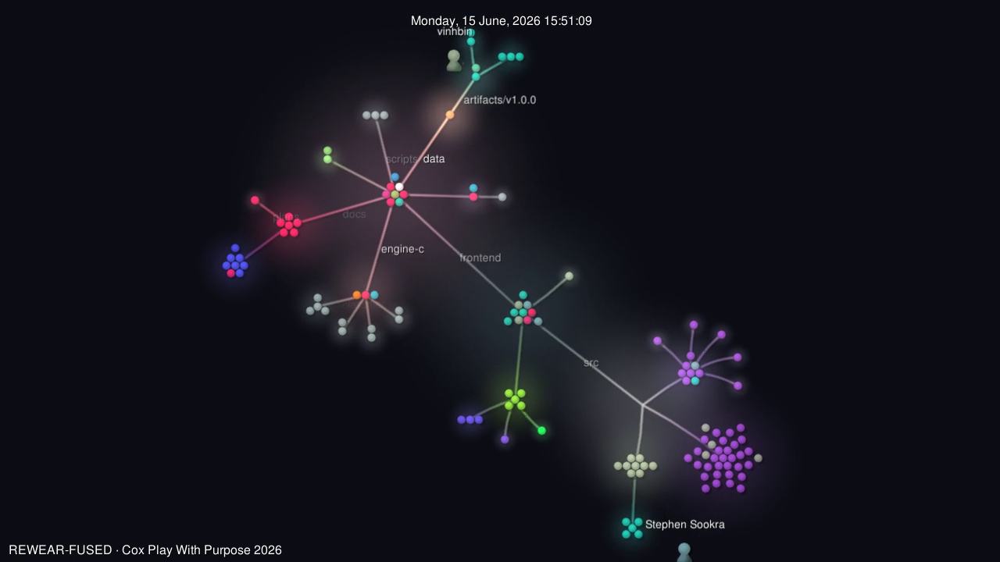

# Visualizations

Three views of REWEAR-FUSED, from broad to specific. The same three-layer stack used to make a repo legible at a glance: motion, rigor, intent.

| Layer | View | What it sells | Open |
|---|---|---|---|
| 1 | **Gource time-lapse** | motion + scale of the build | [`rewear-fused-gource.mp4`](rewear-fused-gource.mp4) |
| 2 | **Codebase graph** (graphify) | engineering rigor: 287 nodes, 401 edges, 60 communities | [live](https://rewear-fused.vercel.app/visualizations/codebase-graph.html) · [`GRAPH_REPORT.md`](GRAPH_REPORT.md) |
| 3 | **3D knowledge graph** (hand-curated) | intent: the co-design loop and the two coupled molecules | [live, interactive](https://rewear-fused.vercel.app/visualizations/knowledge-graph.html) |

## Layer 1, Gource git-history time-lapse

An animated tree of the repository's commit history: files appear, contributors orbit, the structure grows. Rendered with `gource` + `ffmpeg` from the event-window git log.

[](rewear-fused-gource.mp4)

▶ [`rewear-fused-gource.mp4`](rewear-fused-gource.mp4) (3.6 MB, 1280x720)

## Layer 2, Codebase graph (graphify)

Auto-extracted from the source with [graphify](https://pypi.org/project/graphifyy/): every symbol, every import and call edge, clustered into communities. The most-connected "god nodes" are the real load-bearing abstractions: the Engine C API handler `GET()`, the data loaders `v_classification()` / `v_fibers()`, and the frozen-parity boot gate `_verify_frozen_parity()`.

- Interactive: [`/visualizations/codebase-graph.html`](https://rewear-fused.vercel.app/visualizations/codebase-graph.html) (or [`rewear-fused-codebase-graph.html`](rewear-fused-codebase-graph.html))
- Plain-language audit: [`GRAPH_REPORT.md`](GRAPH_REPORT.md)
- RAG-ready node-link JSON: [`rewear-fused-codebase-graph.json`](rewear-fused-codebase-graph.json)

## Layer 3, 3D knowledge graph (hand-curated)

27 nodes across 7 layers (Engine A fiber, Engine B enzyme, Engine C passport, data and provenance, regulation, the co-design loop, prizes), the co-design loop at the center. Glowing orbs, hover-to-trace, click for detail, auto-orbit. WebGL via three.js + 3d-force-graph + bloom, zero build step.

- Live, interactive: [`/visualizations/knowledge-graph.html`](https://rewear-fused.vercel.app/visualizations/knowledge-graph.html)
- Standalone file: [`rewear-fused-knowledge-graph-3d.html`](rewear-fused-knowledge-graph-3d.html)

## How these were made

```bash
# Layer 1: Gource MP4
gource --log-format git --output-custom-log /tmp/log .
gource --seconds-per-day 8 --hide mouse,progress,filenames --bloom-multiplier 0.9 \
  --background-colour 0c0e14 --stop-at-end -1280x720 --output-ppm-stream - /tmp/log \
  | ffmpeg -y -r 30 -f image2pipe -vcodec ppm -i - -vcodec libx264 -crf 18 -pix_fmt yuv420p out.mp4

# Layer 2: graphify codebase graph
pip install graphifyy && graphify update .

# Layer 3: hand-curated 3D graph, three.js + 3d-force-graph + UnrealBloomPass (CDN)
```
